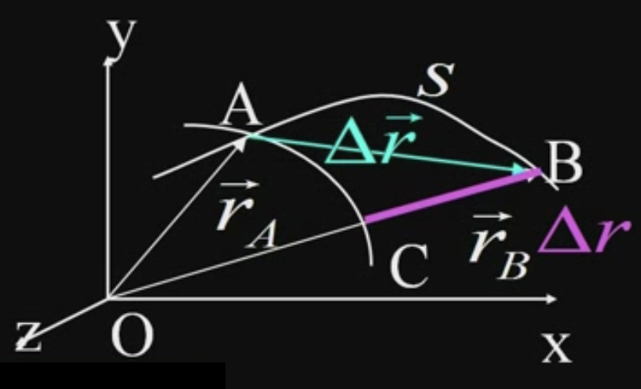

&emsp;
# 质点的运动

## 1 质点的位置
>参考系
- 描述物体运动时被选作参考的其他物体或物体系, 称为 "参考系" 或 "参照系"

>确定质点相对于参考系位置的方法
- 坐标法: 选定 3D 坐标系, 用坐标值 $(x, y, z)$ 来表示空间一质点的位置
- 位矢法: 选一固定点 $O , 由 $O$ 点向质点 $P$ 引一矢量 $\vec{r}$ (位置矢量, 位矢)
- 自然法: 在已知运动轨迹上任选一固定点 $O$ , 规定一正方向, 曲线长度 $s$ 称自然坐标

    

&emsp;
## 2 运动 (学) 方程
用以确定在选定的参考系中质点 `相对坐标系` 的位置随时间 $t$ 变化的数学表达式:
- 坐标法: $x=x(t),  y=y(t),  z=z(t)$
- 位矢法: $\vec{r}=\vec{r}(t)$
- 自然法: $s=f(t)$

    

>Example: 抛物线运动(位矢法)
$$\vec{r}=\vec{v}_0 t+\frac{1}{2} \vec{g} t^2$$

&emsp;
## 3 位移

    

>位矢
- $\vec{r}_A$, $\vec{r}_B$, $\Delta\vec{r}$
>路程
- $S$
>位移 
- 质点在某一段时间内位矢的增量
$$\Delta \vec{r}=\vec{r}_B-\vec{r}_A$$

>时间与时刻
- $t$
>位移 (位矢增量) 的大小
$$|\Delta \vec{r}|=\left|\vec{r}_B-\vec{r}_A\right|$$

>位矢大小的增量
$$\Delta r=\left|\vec{r}_B\right|-\left|\vec{r}_A\right|$$

>注意
$$|\Delta \vec{r}| \neq \Delta r$$

&emsp;
## 4 速度

Speed or Velocity?

    

>Speed 平均速度
$$
\overline{\vec{v}}=\frac{\Delta \vec{r}}{\Delta t}
$$

>Velocity 瞬时速度
$$\vec{v}=\lim _{\Delta t \rightarrow 0} \frac{\vec{r}(t+\Delta t)-\vec{r}(t)}{\Delta t}=\lim _{\Delta t \rightarrow 0} \frac{\Delta \vec{r}}{\Delta t}=\frac{d \vec{r}}{d t}$$

