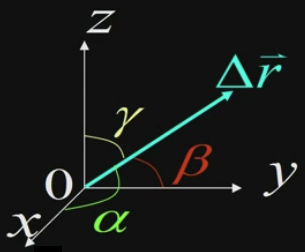
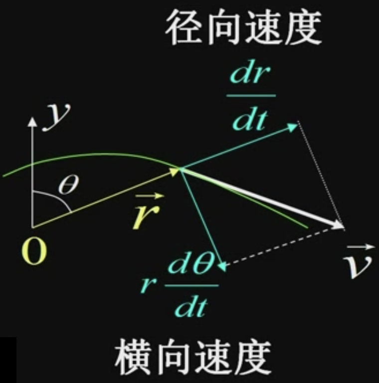
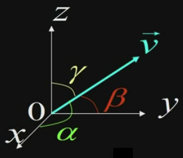

&emsp;
# 直角坐标系下的位移、速度、加速度

## 1 位移

    

>位矢
$$\vec{r}_1=x_1 \vec{i}+y_1 \vec{j}+z_1 \vec{k} \quad \vec{r}_2=x_2 \vec{i}+y_2 \vec{j}+z_2 \vec{k}$$

>位移
$$\begin{aligned}
\Delta \vec{r}=\vec{r}_2-\vec{r}_1 &=\Delta x \vec{i}+\Delta y \vec{j}+\Delta z \vec{k} \\
& =\left(x_2-x_1\right) \vec{i}+\left(y_2-y_1\right) \vec{j}+\left(z_2-z_1\right) \vec{k}
\end{aligned}$$

>位移的大小
$$\begin{aligned}|\Delta \vec{r}| &=\left|\vec{r}_2-\vec{r}_1\right| \\
&=\sqrt{\left(x_2-x_1\right)^2+\left(y_2-y_1\right)^2+\left(z_2-z_1\right)^2}\end{aligned}$$

>位移的方向
- 三个方向的分量, 或者说投影
$$\cos \alpha=\frac{\Delta x}{|\Delta \vec{r}|}, \quad \cos \beta=\frac{\Delta y}{|\Delta \vec{r}|}, \quad \cos \gamma=\frac{\Delta z}{|\Delta \vec{r}|}$$

&emsp;
## 2 速度
$$\begin{aligned} & \vec{v}=v_x \vec{i}+v_y \vec{j}+v_z \vec{k} \\ \\
& \vec{v}=\frac{d x}{d t} \vec{i}+\frac{d y}{d t} \vec{j}+\frac{d z}{d t} \vec{k}\end{aligned}$$

>Speed 速率
$$v=|\vec{v}|=\sqrt{v_x^2+v_y^2+v_z^2}$$

>思考: $\frac{d r}{d t}$ 是速率吗? $\left|\frac{d \vec{r}}{d t}\right|$ 与 $\left|\frac{d r}{d t}\right|$ 有什么区别

    

- $\left|\frac{d \vec{r}}{d t}\right| = \vec{v}$
- 径向速度和横向速度是 $\vec{v}$ 的两个分量

&emsp;
## 3 加速度

$$
\begin{aligned}
& \vec{a}=\frac{d \vec{v}}{d t}=\frac{d v_x}{d t} \vec{i}+\frac{d v_y}{d t} \vec{j}+\frac{d v_z}{d t} \vec{k} \\ \\
& \vec{a}=\frac{d^2 \vec{r}}{d t^2}=\frac{d^2 x}{d t^2} \vec{i}+\frac{d^2 y}{d t^2} \vec{j}+\frac{d^2 z}{d t^2} \vec{k}
\end{aligned}
$$

>加速度的分量
$$a_x=\frac{d v_x}{d t}=\frac{d^2 x}{d t^2}$$
$$a_y=\frac{d v_y}{d t}=\frac{d^2 y}{d t^2}$$
$$a_z=\frac{d v_z}{d t}=\frac{d^2 z}{d t^2}$$

>加速度的大小
$$
\begin{aligned}
|\vec{a}|=\sqrt{a_x^2+a_y^2+a_z^2} & =\sqrt{\left(\frac{d v_x}{d t}\right)^2+\left(\frac{d v_y}{d t}\right)^2+\left(\frac{d v_z}{d t}\right)^2} \\
& =\sqrt{\left(\frac{d^2 x}{d t^2}\right)^2+\left(\frac{d^2 y}{d t^2}\right)^2+\left(\frac{d^2 z}{d t^2}\right)^2}
\end{aligned}
$$

>速度和加速度的方向
- 用 3 个方位角 $\alpha, \beta, \gamma$

    

$$\cos \alpha=\frac{v_x}{|\vec{v}|},\quad \cos \beta=\frac{v_y}{|\vec{v}|}, \quad \cos \gamma=\frac{v_z}{|\vec{v}|}$$
$$\cos \alpha^{\prime}=\frac{a_x}{|\vec{a}|},\quad \cos \beta^{\prime}=\frac{a_y}{|\vec{a}|}, \quad \cos \gamma^{\prime}=\frac{a_z}{|\vec{a}|}$$

&emsp;
## 4 质点运动学的基本问题
>已知运动方程, 求速度, 加速度
- 用微分法
$$
\vec{v}=\frac{d \vec{r}}{d t}, \quad \vec{a}=\frac{d \vec{v}}{d t}
$$

>已知加速度和初始条件, 求速度、位移、路程和运动方程
- 或已知速度和初始条件, 求位移、路程和运动方程）
- 用积分法

$$\vec{v}-\vec{v}_0=\int_{t_0}^t \vec{a} \cdot d t, \quad \vec{r}-\vec{r}_0=\int_{t_0}^t \vec{v} \cdot d t
$$