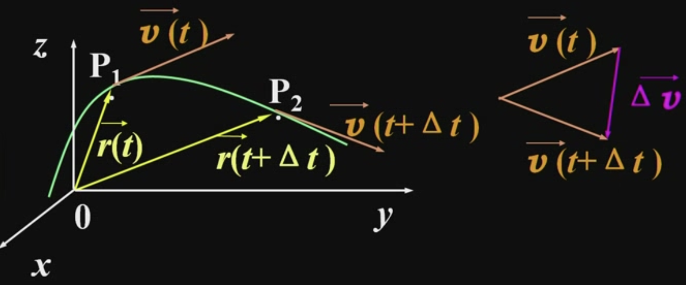

&emsp;
# 加速度

    

>速度的增量
$$\Delta \vec{v}=\vec{v}_{P 2}-\vec{v}_{P 1}$$

>平均加速度
$$\overline{\vec{a}}=\frac{\Delta \vec{v}}{\Delta t}$$

>瞬时加速度
$$
\vec{a}=\lim _{\Delta \rightarrow 0} \frac{\Delta \vec{v}}{\Delta t}=\frac{d \vec{v}}{d t}=\frac{d^2 \vec{r}}{d t^2}
$$