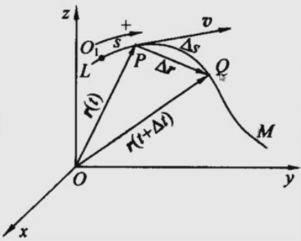
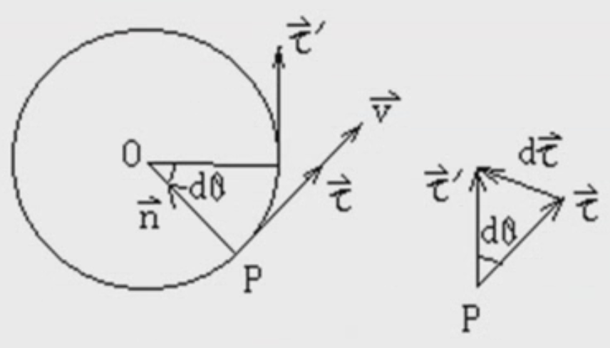
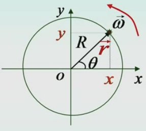

&emsp;
# 自然坐标下的速度、加速度

## 1 Linear Velocity 线速度
某一时刻 $t$ 处于 $P$ 点位置, 经过一定时间 $\Delta t$ 之后，移动到点 $Q$

    

我们由之前的知识可以知道:
$$\vec{v}=\lim _{\Delta t \rightarrow 0} \frac{\Delta \vec{r}}{\Delta t}$$

简单的用数学技巧做一下变换:
$$\lim \left(\frac{\Delta \vec{r}}{\Delta s} \frac{\Delta s}{\Delta t}\right)
=\left(\lim \frac{\Delta \vec{r}}{\Delta s}\right)\left(\lim \frac{\Delta s}{\Delta t}\right)=\frac{d \vec{r}}{d s} \frac{d s}{d t} $$

>方向
- 当 $Q$ 无限靠近 $P$ 点时，位移的大小 $\Delta r$ 和弧长 $\Delta s$ 的大小相等
- 无限靠近时 $\tau$ 的方向就是 $P$ 点的切线方向
    $$ \left(\lim _{\Delta t \rightarrow 0} \frac{\Delta \vec{r}}{\Delta s}\right)=\frac{d \vec{r}}{d s}=\vec{\tau} \\
    $$

>大小 Magnetude
- 大小就是这段无穷小的弧长的大小
$$v=\lim _{\Delta t \rightarrow 0} \frac{\Delta s}{\Delta t}=\frac{d s}{d t}$$

>线速度
$$\vec{v}=v \vec{\tau}=\frac{d s}{d t} \vec{\tau}$$

>切线方向、法向单位矢量
$$\vec{\tau} \equiv \vec{e}_t, \quad \vec{n} \equiv \vec{e}_n$$

&emsp;
## 2 Linear Accelerate Velocity 加速度

    

>速度/速率
$$\quad \vec{v}=v \vec{\tau}=\frac{d s}{d t} \vec{\tau}$$

>加速度
$$\quad \vec{a}=\frac{d}{d t}(v \vec{\tau})=\frac{d v}{d t} \vec{\tau}+v \frac{d \vec{\tau}}{d t} \tag{1}$$
- 其中, $d \vec{\tau}$ 微分可以看作是弧长 $|\tau| d \theta$, 微分时, 无限接近 $P$ 点, 方向为法线方向 $\vec{n}$, 所以:
    $$d \vec{\tau}=|\tau| d \theta \vec{n}=d \theta \vec{n}\tag{2}$$
- 将 $(2)$ 代入 $\frac{d \vec{\tau}}{d t}$ 得
    $$\frac{d \vec{\tau}}{d t}=\frac{d \theta}{d t} \vec{n}=\frac{R d \theta}{R d t} \vec{n}=\frac{1}{R} \frac{d s}{d t} \vec{n}=\frac{v}{R} \vec{n}\tag{3}$$
- 把 $(3)$ 代入 $(1)$ 整合一下
    $$\vec{a}=\frac{d v}{d t} \vec{\tau}+\frac{v^2}{R} \vec{n}=a_\tau \vec{\tau}+a_n \vec{n}\tag{4}$$
- 所以我们可以把加速度分为两个相互垂直的向量的和
    $$a=|\vec{a}|=\sqrt{a_\tau^2+a_n^2}$$
    - 切线加速度: $a_\tau=\frac{d v}{d t}$, 管速度大小
    - 法线加速度: $a_n=\frac{v^2}{R}$, 速度方向的变化

&emsp;
## 2 Angular Velocity 角速度

    

### 2.1 圆周运动的角量
>方向
- 角速度 $\overrightarrow{\omega}$ 的方向按 "右手定则" 确定, 四指方向为正

>角速度 
$$\omega=\lim _{\Delta t \rightarrow 0} \frac{\Delta \theta}{\Delta t}=\frac{d \theta}{d t}$$
>角加速度 
$$\alpha=\lim _{\Delta t \rightarrow 0} \frac{\Delta \omega}{\Delta t}=\frac{d \omega}{d t}=\frac{d^2 \theta}{d t^2}$$

### 2.2 线量与角量

>线速度与角速度 
$$v=R \omega \quad(\because \Delta s=R \cdot \Delta \theta)$$

>切向加速度与角加速度 
$$a_\tau=R \alpha$$

>法向加速度与角速度 
$$a_n=\frac{v^2}{R}$$
- 将其中一个 $v$ 用 $v=R \omega$ 代入: $a_n=\frac{v^2}{R}=v \omega$
- 将其中两个 $v$ 用 $v=R \omega$ 代入: $a_n=\frac{v^2}{R}=R \omega^2$

### 2.3 速度
>速度分量式
$$
\begin{aligned}
& v_x=\frac{d x}{d t}=\frac{d}{d t}(R \cos \omega t)=-R \omega \sin \omega t \\
& v_y=\frac{d y}{d t}=\frac{d}{d t}(R \sin \omega t)=R \omega \cos \omega t \\
& v=\sqrt{v_x^2+v_y^2}=R \omega
\end{aligned}
$$
>速度矢量式
$$
\begin{aligned}
\vec{v} & =\frac{d \vec{r}}{d t}=v_x \vec{i}+v_y \vec{j} \\
& =R \omega(-\sin \omega t \vec{i}+\cos \omega t \vec{j})
\end{aligned}
$$

### 2.4 加速度
$$
\begin{aligned}
& v_x=-R \omega \sin \omega t \\
& v_y=R \omega \cos \omega t
\end{aligned}
$$
>加速度分量式
$$
\begin{aligned}
& a_x=\frac{d v_x}{d t}=-R \omega^2 \cos \omega t \\
& a_y=\frac{d v_y}{d t}=-R \omega^2 \sin \omega t \\
& a=|\vec{a}|=\sqrt{a_x^2+a_y^2}=R \omega^2
\end{aligned}
$$

&emsp;
## 3 匀变速率圆周运动

$\alpha=$ 常量, 故
- 切线加速度: $a_{t}=r \alpha$
- 法向加速度: $a_{n}=r \omega^2$

根据加速度的定义 $\alpha=\frac{d \omega}{dt}=$ 常量

又
$$\begin{aligned}
& d \omega=\alpha d t \\
& ~d \theta=\omega d t\end{aligned}\tag{1}$$

如 $t=0$ 时, 初角度 $\theta=\theta_0$, 初角速度 $\omega=\omega_0$

对 $(1)$ 两个式子分别积分可得: 
>匀变速率圆周运动
$$\left\{\begin{array}{l}\omega=\omega_0+\alpha t \\ \theta=\theta_0+\omega_0 t+\frac{1}{2} \alpha t^2 \\ \omega^2=\omega_0^2+2 \alpha\left(\theta-\theta_0\right)\end{array}\right.$$

>匀变速率直线运动
- 两者对比一下
$$\begin{aligned}
& v=v_0+a t \\
& s=s_0+v_0 t+\frac{1}{2} a t^2 \\
& v^2=v_0^2+2 a\left(s-s_0\right)
\end{aligned}$$