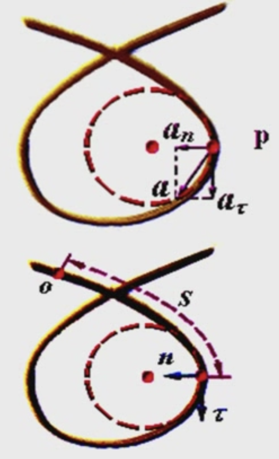

&emsp;
# 一般平面曲线运动

一般平面曲线运动, 曲率半径是变化的, 通常用 $\rho$ 来表示

    

圆周运动的加速度公式还可以用, 但是不能用 $R$ 了, 因为曲率一直在变

>加速度
$$
\begin{aligned}
& \vec{a}=\vec{a}_\tau+\vec{a}_n=a_\tau \vec{\tau}+a_n \vec{n} \\
& \vec{a}=\vec{a}_\tau+\vec{a}_n=\frac{d v}{d t} \vec{\tau}+\frac{v^2}{\rho} \vec{n}
\end{aligned}
$$

>切线、法向加速度
$$a_\tau=\frac{d v}{d t}, \quad a_n=\frac{v^2}{\rho}$$

>加速度大小
$$a=|\vec{a}|=\sqrt{a_\tau^2+a_n^2}$$

>切向加速度与加速度间的夹角 $\theta$
- 满足:
$$\tan \theta=\frac{a_n}{a_\tau}$$

>思考：匀速圆周运动： $v=$ ? $a_\tau=$ ? $a_{\mathrm{n}}=$ ? $a=$ ?
$$v=C, \quad a_\tau=\frac{d v}{d t}=0, \quad a=a_n=\frac{v^2}{R}$$