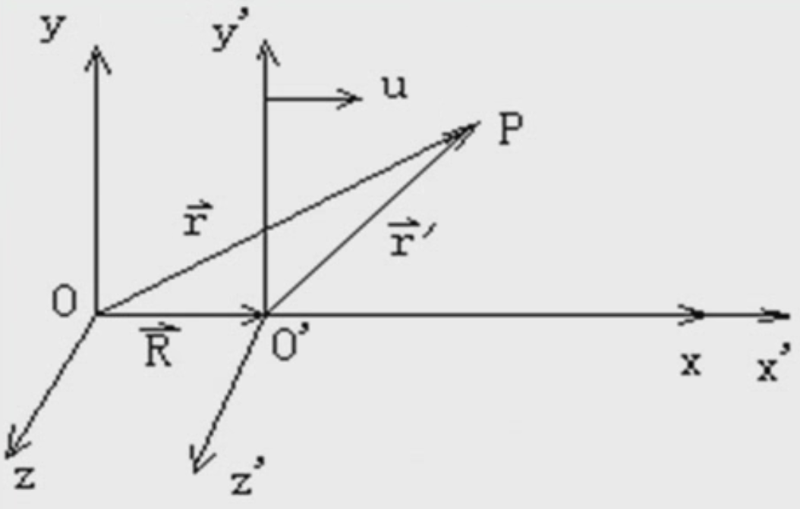

&emsp;
# 相对运动

## 1 伽利略坐标变换

    

$$
\begin{aligned}
& \vec{r}=\vec{R}+\vec{r}^{\prime} \\
& 或\left\{\begin{array}{l}
x^{\prime}=x-u t \\
y^{\prime}=y \\
z^{\prime}=z \\
t^{\prime}=t
\end{array}\right. \\
&
\end{aligned}
$$

>速度变换定理
$$\vec{v}_a=\vec{v}_r+\vec{u}$$
- $\vec{u}$: 牵连速度
- $\vec{v}_r$: 相对速度
- $\vec{v}_a$: 绝对速度

>加速度变换定理
- 当两个坐标系之间的相对运动速度 (牵连速度) 不是常量时, 就存在一个加速度——牵连加速度 $\vec{a}_e$
    $$\vec{a}_a=\vec{a}_r+\vec{a}_e$$
    - $\vec{a}_e$: 牵连加速度
    - $\vec{a}_r$: 相对加速度
    - $\vec{a}_a$: 绝对加速度

